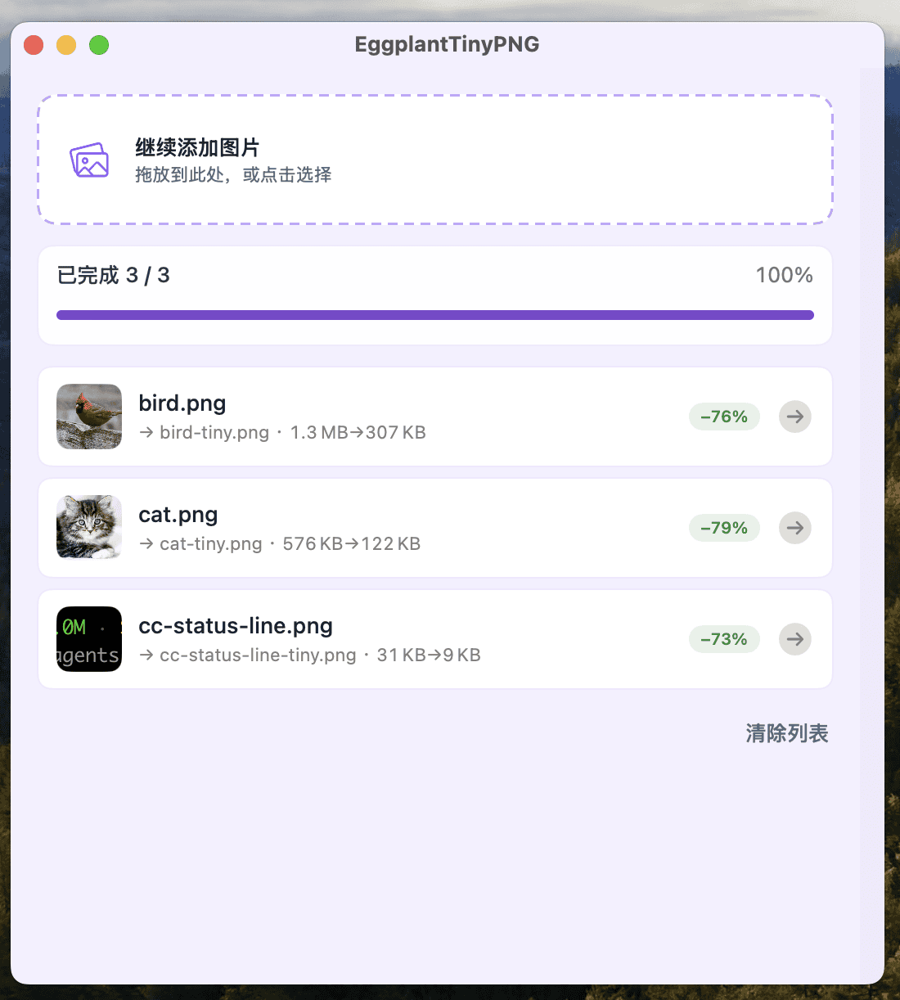

# EggplantTinyPNG

原生 **macOS 15+** 图片压缩工具 — 拖入照片，在本机压小，原图保留不动。

[English](./README.md)

下载见 **[Releases](https://github.com/uniquejava/EggplantTinyPNG/releases)**（DMG，ad-hoc 签名，**未**公证）。

## 能做什么

- **拖入或打开** PNG、JPEG、WebP
- **全程本地压缩** — 不会上传到任何服务器
- **自动保存**到原图旁边：`原名-tiny.ext`
- 看整批进度；完成后可在 Finder 里定位，或点 **覆盖原图**
- 设置里可换主题和语言（跟随系统 / English / 简体中文）

关掉窗口不会退出，图标还在 Dock；要退出用 ⌘Q。

## 开始用

1. 从 DMG 安装（拖到「应用程序」）。
2. 若系统拦截：`xattr -cr /Applications/EggplantTinyPNG.app`
3. PNG 效果更好：装一次 `brew install pngquant oxipng`
4. 把图片拖进去即可。

## 从源码构建

见 [docs/commands.md](./docs/commands.md)。需要 macOS 15+ 与 Xcode 16+。

## 更多

- [v0.2.0 发行说明](./docs/releases/v0.2.0.md)（中 / 英）
- [AGENTS.md](./AGENTS.md) — 给贡献者看的说明
